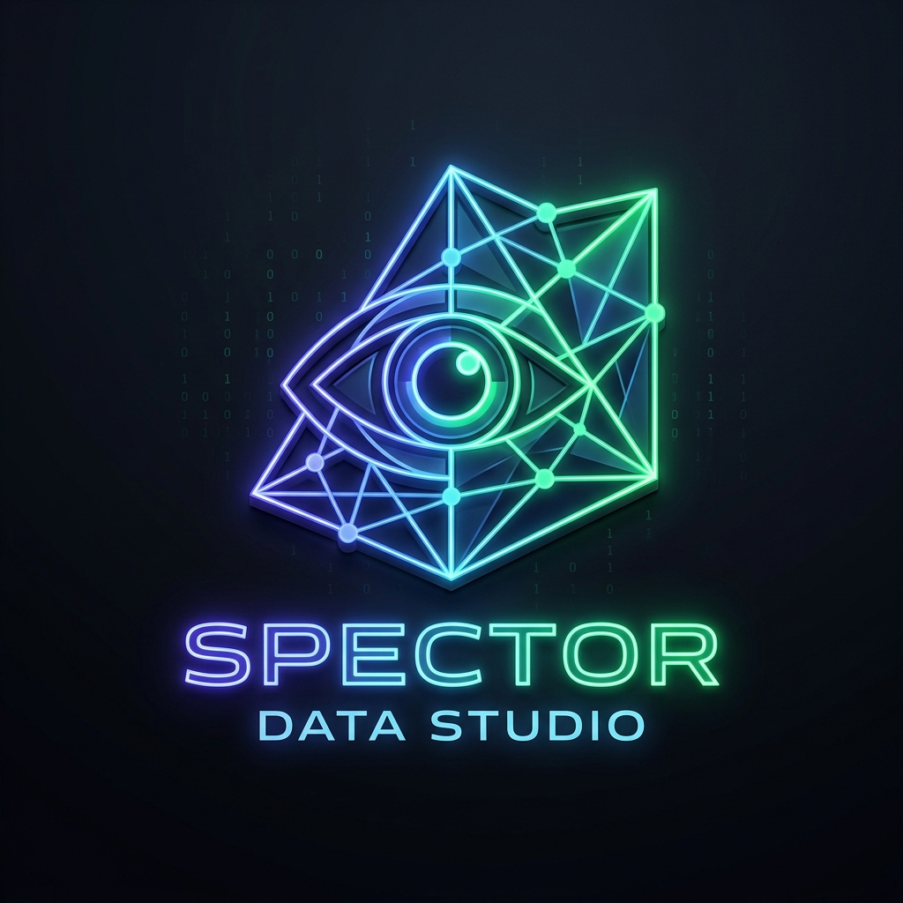
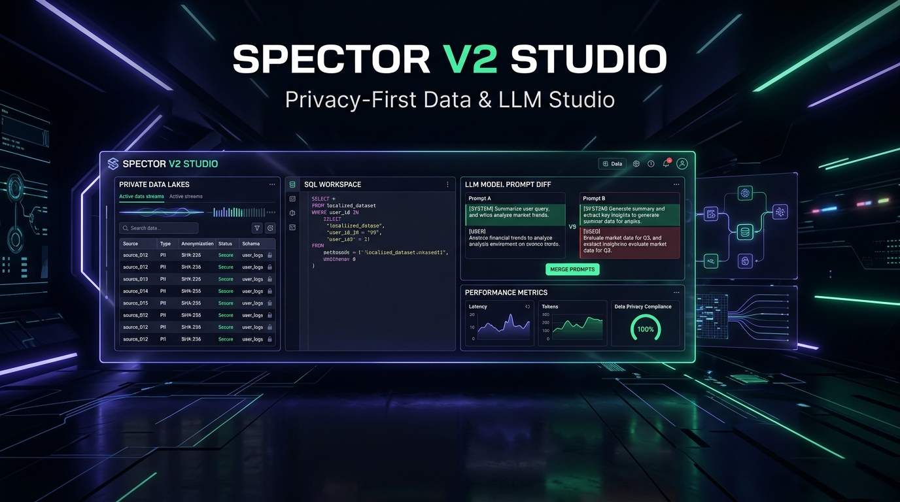

# ⚡ Spector V2 Studio

<p align="center">
  
</p>

<p align="center">
  <b>The Privacy-First Data & LLM Evaluation Studio.</b><br/>
  Inspect, query with SQL, compare prompt diffs, and sanitize private datasets 100% in-browser. Zero servers, zero tracking, zero limits.
</p>

---



[](LICENSE)
[](https://github.com/SyedaAnshrahGillani/Spector)
[](CONTRIBUTING.md)

---

## 🌟 Why Spector V2 Exists

Building and fine-tuning AI/LLM models requires constantly inspecting **structured datasets** — prompts, model responses, evaluations, logs, and benchmark runs.

Existing web dataset viewers require **cloud uploads**, **paid private tier subscriptions** (e.g. Hugging Face Datasets paid plans), or bulky desktop environments.

**Spector V2 Studio bridges this gap**: A lightweight, zero-dependency, 100% client-side studio for inspecting private datasets on your local machine with enterprise-grade features.

---

## 🚀 Key V2 Features

### 🔗 1. Direct GitHub Repository & File Auto-Sync
- Paste any GitHub file link (`github.com/user/repo/blob/main/data/llm_benchmark.json`) or raw URL.
- Stream datasets directly from GitHub without manually downloading & uploading.
- Supports private enterprise repos via Personal Access Tokens (PAT).

### ⚡ 2. In-Browser SQL Query Console (DuckDB Powered)
- Execute real SQL queries directly over loaded datasets:
```sql
SELECT model_name, quality_score FROM dataset WHERE quality_score > 0.9 ORDER BY latency_ms ASC LIMIT 50
```

### 🤖 3. Side-by-Side LLM Prompt/Response Diff Viewer
- Compare model outputs (e.g., GPT-4 vs Llama-3, or Prompt V1 vs Prompt V2) side-by-side with character counters and syntax highlighting.

### 🛡️ 4. Client-Side PII Privacy Guard & Anonymizer
- 100% offline one-click redaction of sensitive data:
  - Emails (`user@example.com` → `[REDACTED_EMAIL]`)
  - Secret API Keys (`sk-...`, `ghp_...` → `[REDACTED_API_TOKEN]`)
  - IP Addresses (`192.168.1.1` → `[REDACTED_IP]`)
  - Credit Card & SSN numbers

### 📊 5. Dataset Health & Token Profiler
- Total dataset token count estimation (Tiktoken compatible).
- Instant API cost estimation across GPT-4o, Claude 3.5 Sonnet, and Llama 3 models.
- Completeness bars & missing value analysis per column.

### 📂 6. Universal Multi-Format Support
- Instant drag-and-drop parsing for **JSON**, **JSONL**, **CSV**, and **TSV** datasets.

---

## 💻 Quick Start Options

### Option A: Open directly in Browser (Zero Install)
Simply open `index.html` in any modern web browser or serve locally:
```bash
git clone https://github.com/SyedaAnshrahGillani/Spector.git
cd Spector
python3 -m http.server 8090
```
Then visit: `http://localhost:8090`

### Option B: Run via Terminal CLI
Launch Spector instantly from your terminal:
```bash
npx spector-cli ./data/llm_benchmark.json
```

---

## 🎨 Tech Stack & Architecture

| Layer | Technology |
|---|---|
| **Core Architecture** | Native ES Modules, HTML5, CSS3 Tokens |
| **Parsing Engine** | Web Worker Multi-Format Parser (JSON, JSONL, CSV, TSV) |
| **SQL Engine** | In-Browser SQL Execution Engine |
| **Privacy & Security** | 100% Client-Side Local Memory Processing |
| **Styling System** | Obsidian Cyber Dark & Light Theme System |

---

## 🤝 Contributing

Contributions are welcome! Please feel free to open an issue or submit a pull request.
Check out [CONTRIBUTING.md](CONTRIBUTING.md) for contribution guidelines.

---

## 📜 License

[MIT License](LICENSE) © **Syeda Anshrah Gillani**
