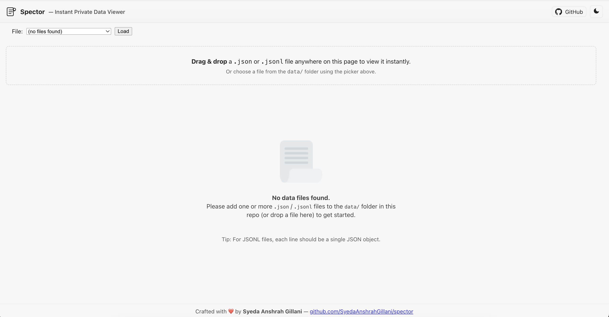

# Spector — Instant Private Data Viewer

**Crafted with ❤️ by Syeda Anshrah Gillani** — [github.com/SyedaAnshrahGillani/spector](https://github.com/SyedaAnshrahGillani/spector)


🎬 **Spector in action — instant data exploration**


Spector is a **lightweight, offline JSON / JSONL viewer** designed for developers, data scientists, and AI practitioners. Drag & drop files or select from the `data/` folder to inspect your data instantly — all in the browser. No uploads, no telemetry, 100% client-side.

It’s perfect for exploring **LLM datasets**, evaluation records, instruction-response pairs, prompts, and structured JSON data.

---

## Quick Start — Run Locally

> Open `index.html` and let Spector read files in `data/`. A simple static server allows directory listing.

### 1. Clone the repository

```bash
git clone https://github.com/SyedaAnshrahGillani/spector.git
cd spector
```

### 2. Add your data files

Create a `data/` folder (if it doesn’t exist) and put your `.json` or `.jsonl` files directly inside:

```
spector/
 ├─ index.html
 ├─ data/
 │   ├─ llm_qa.json
 │   ├─ llm_eval.jsonl
 │   ├─ llm_prompts.json
 │   └─ vibe_queries.jsonl
```

**Example `data/llm_qa.json`** (array of Q&A records):

```json
[
  {"id":1,"question":"What is the capital of France?","answer":"Paris","category":"geography","difficulty":"easy"},
  {"id":2,"question":"Explain recursion in programming.","answer":"Recursion is when a function calls itself to solve smaller subproblems.","category":"programming","difficulty":"medium"}
]
```

**Example `data/llm_eval.jsonl`** (newline-delimited JSON):

```jsonl
{"id":101,"instruction":"Translate: 'Hello, how are you?'", "response":"Bonjour, comment ça va ?", "category":"translation","quality":"high"}
{"id":102,"instruction":"Classify sentiment: 'I love this product!'", "response":"Positive", "category":"sentiment-analysis","quality":"high"}
```

**Example `data/llm_prompts.json`** (array of prompts):

```json
[
  {"id":1,"prompt":"Write a 4-line poem about the sea.","type":"creative-writing","difficulty":"medium"},
  {"id":2,"prompt":"Explain the difference between supervised and unsupervised learning.","type":"machine-learning","difficulty":"medium"}
]
```

**Example `data/vibe_queries.jsonl`** (real-world task prompts):

```jsonl
{"idx": 1, "query": "Design and build a portfolio site for a top‑tier design agency...", "domain": "web", "difficulty": "easy"}
{"idx": 2, "query": "Reimagine our boutique hotels’ booking experience...", "domain": "web", "difficulty": "easy"}
{"idx": 3, "query": "Create a SvelteKit server health dashboard...", "domain": "web", "difficulty": "easy"}
```

---

### 3. Serve the folder with Python

```bash
python3 -m http.server 8000
```

* Opens a static server on port **8000**.
* Visit `http://localhost:8000` in your browser.
* Stop the server: `Ctrl + C`.

**Windows note:**

```bash
py -3 -m http.server 8000
```

**Optional LAN access (be cautious):**

```bash
python3 -m http.server 8000 --bind 0.0.0.0
```

---

### 4. Use Spector

* Open `http://localhost:8000`.
* Use the **file picker** to select a file from `data/`.
* Or **drag & drop** any `.json` / `.jsonl` file anywhere on the page.
* Click a row to open the **formatted JSON drawer**.
* Sort, paginate, and explore arrays or objects instantly.

---

## Empty State / Placeholder

If `data/` is empty, Spector displays a friendly placeholder:



> Drag & drop your first JSON or JSONL file to start exploring data instantly.

---

## Demo Videos

See Spector in action:

| Action                      | Video                                                                                            |
| --------------------------- | ------------------------------------------------------------------------------------------------ |
| Upload data & explore       | <video width="300" controls><source src="src/videos/upload_data.mp4" type="video/mp4"></video>   |
| View examples & JSON drawer | <video width="300" controls><source src="src/videos/view_examples.mp4" type="video/mp4"></video> |

---

## Why use a local server?

Modern browsers block certain operations (like fetching directory listings) when opening `index.html` via `file://`. Serving over HTTP allows:

* Dynamic fetching of files in `data/`
* Populating the picker automatically
* Smooth client-side JSON/JSONL rendering

---

## Handling Large Datasets

* Spector **paginates rows** in the browser.
* For very large files (>50MB), consider **sampling** or **splitting**.
* Click any row to inspect **nested JSON** fully in the drawer.

---

## Hosting Notes

* **GitHub Pages**: directory listing not available → use `manifest.json` or static `data/index.html`.
* **Other static hosts**: same, directory listing may fail → manifest recommended.

**Example manifest:**

```json
{
  "files": [
    "llm_qa.json",
    "llm_eval.jsonl",
    "llm_prompts.json",
    "vibe_queries.jsonl"
  ]
}
```

---

## Troubleshooting

* **Picker shows `(no files found)`** → confirm `data/` exists and contains files.
* **404 when loading a file** → check file name casing.
* **Files don’t appear on GitHub Pages** → use manifest or static index.

---

## Alternative Server (Node.js)

```bash
npm install -g serve
serve -p 8000
# or
npx serve -p 8000
```

---

## Contribution & Contact

* Fork → branch → commit → PR.
* Open issues for bugs or feature requests.
* Ideas: keyboard navigation, CSV support, manifest UI improvements, filtering.

**Thank you for exploring Spector — your local JSON/JSONL companion by Syeda Anshrah Gillani!**

---

## License

MIT — see `LICENSE`.

---
