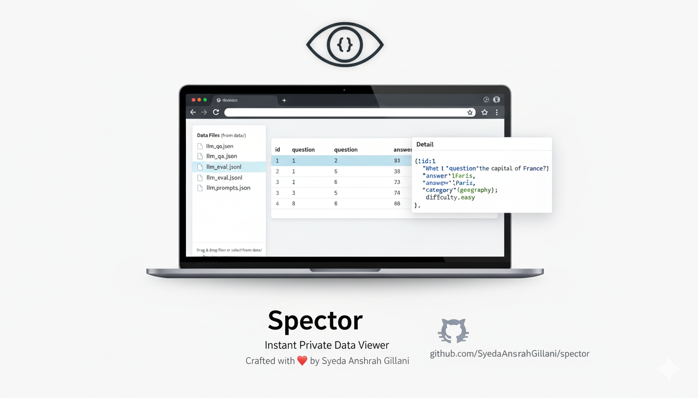

# Spector — Instant Private Data Viewer

**Crafted with ❤️ by Syeda Anshrah Gillani**
🔗 [https://github.com/SyedaAnshrahGillani/spector](https://github.com/SyedaAnshrahGillani/spector)



🎬 **Spector in action — upload, inspect, explore**


---

## Why Spector Exists

Working with AI and LLM systems means constantly inspecting **structured datasets** — prompts, responses, evaluations, logs, and experiments.

Platforms like **Hugging Face Datasets** provide excellent dataset viewers. However, visual exploration of **private datasets** requires a paid subscription, which is often not feasible for:

* proprietary or client-owned data
* sensitive research datasets
* early-stage experiments
* independent developers and researchers

At the same time, local workflows fall short:

* text editors are too raw
* spreadsheets flatten structure
* custom scripts cost time
* heavy tools interrupt focus

**Spector was built to bridge this gap** — a simple, offline, zero-cost way to visually explore private JSON and JSONL data, directly on your own machine.

---

## What Spector Is

Spector is a **lightweight, offline JSON / JSONL viewer** for developers, AI engineers, and researchers.

It runs entirely in the browser using **HTML, CSS, and vanilla JavaScript**, with no backend and no dependencies.

> **From raw data to clarity — instantly and privately.**

---

## Key Features

* 📂 Drag & drop `.json` / `.jsonl` files
* 📁 Auto-detect files from a local `data/` folder
* 📊 Paginated, sortable table view
* 🧾 Expandable JSON drawer for nested objects
* 🌗 Dark / light theme toggle
* 🧠 Designed for **LLM datasets and evaluations**
* 🔒 100% client-side (no uploads, no tracking)
* 🧩 Friendly empty state with guidance

---

## Tech Stack

| Layer   | Technology         |
| ------- | ------------------ |
| Markup  | HTML5              |
| Styling | CSS                |
| Logic   | Vanilla JavaScript |
| Runtime | Browser            |

---

## Example Workflow

🎬 **Load example datasets and inspect records**


---

## Quick Start — Run Locally

### 1. Clone the repository

```bash
git clone https://github.com/SyedaAnshrahGillani/spector.git
cd spector
```

### 2. Add your data

Place `.json` or `.jsonl` files **directly** inside the `data/` folder:

```
spector/
 ├─ index.html
 ├─ data/
 │   ├─ llm_qa.json
 │   ├─ llm_eval.jsonl
 │   ├─ llm_prompts.json
 │   └─ vibe_queries.jsonl
```

---

## Included Dataset Examples

### `data/llm_qa.json`

```json
[
  {"id":1,"question":"What is the capital of France?","answer":"Paris","difficulty":"easy"},
  {"id":2,"question":"Explain recursion.","answer":"A function calling itself.","difficulty":"medium"}
]
```

### `data/llm_eval.jsonl`

```jsonl
{"instruction":"Translate 'Hello'","response":"Bonjour","quality":"high"}
{"instruction":"Classify sentiment","response":"Positive","quality":"high"}
```

### `data/vibe_queries.jsonl`

```jsonl
{"idx":1,"query":"Design a premium portfolio site...","domain":"web","difficulty":"easy"}
{"idx":2,"query":"Reimagine a hotel booking experience...","domain":"web","difficulty":"easy"}
```

---

## Core Use Cases

### AI & ML Engineers

* Inspect private LLM datasets locally
* Debug prompt–response pairs
* Review evaluation outputs before training

### Researchers

* Validate dataset quality and structure
* Explore experimental data safely

### Developers

* Visualize API responses
* Inspect deeply nested JSON structures

---

## Empty State Experience


> Drag & drop a JSON or JSONL file to begin exploring.

---

## Demo Videos

| Action                      | Link                                              |
| --------------------------- | ------------------------------------------------- |
| Upload data & explore       | [upload_data.mp4](src/videos/upload_data.mp4)     |
| View examples & JSON drawer | [view_examples.mp4](src/videos/view_examples.mp4) |

---

## Why a Local Server Is Required

Browsers restrict file access when opening `index.html` directly.

Run a local server:

```bash
python3 -m http.server 8000
```

Then open: `http://localhost:8000`

---

## Hosting Notes

* **GitHub Pages** does not support directory listing
  Use a `data/manifest.json` or a static `data/index.html`

Example manifest:

```json
{
  "files": [
    "llm_qa.json",
    "llm_eval.jsonl",
    "llm_prompts.json",
    "vibe_queries.jsonl"
  ]
}
```

---

## Release Notes

| Version   | Date       | Highlights |
|----------|-----------|------------|
| 🚀 **v1.0.0** | 2025-12-28 | Initial release — offline JSON/JSONL viewer, LLM datasets support, drag & drop & file picker, table with pagination & sorting, JSON drawer for nested objects, empty state placeholder, demo media, full HTML/JS implementation, professional README, MIT license |


---

## A Personal Note

Spector is a **solo, problem-driven project**.

It was created while working with private datasets where existing viewers required paid plans or data uploads — neither of which aligned with real-world constraints.

This project is shared freely to help fellow developers and AI engineers visualize their data without barriers.

---

## Contributing

Contributions are welcome:

* Fork → branch → PR
* Feature ideas: filtering, CSV support, keyboard navigation

---

## License

**MIT License** — free to use, modify, and share.

---

⭐ If Spector helps you, consider starring the repository — it supports independent open-source work.

